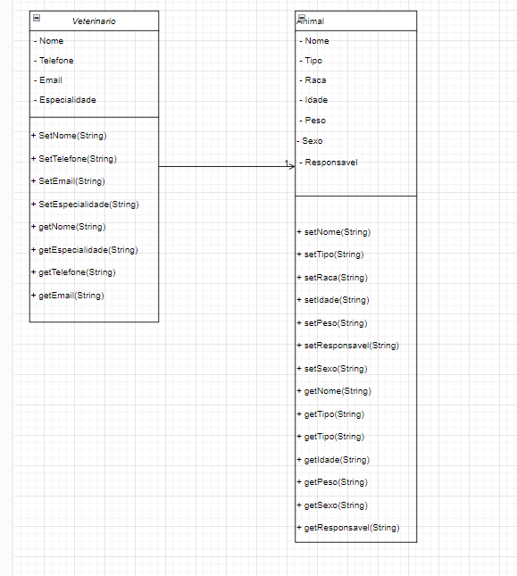

# Engenharia de Software - Atividade 1

## 1 - Programming Over Time

O trecho destaca que a engenharia de software vai além da simples programação, abrangendo ferramentas e processos necessários para manter o código útil e sustentável ao longo do tempo. Um dos desafios centrais é garantir que o código continue sendo valioso à medida que evolui, exigindo práticas que facilitem sua manutenção e adaptação a novas necessidades.

Outro ponto relevante é a ideia de "programação ao longo do tempo", que sugere que o software não deve ser visto apenas como um produto estático, mas como algo dinâmico, que precisa ser planejado considerando mudanças futuras. O texto apresenta três fatores essenciais que influenciam essa longevidade: Tempo e Mudança, Escala e Crescimento, e Trade-offs e Custos.

### Comentário:
O conceito apresentado reforça que a engenharia de software não se limita a criar código funcional, mas também a planejar sua evolução ao longo do tempo. É fundamental que desenvolvedores adotem práticas que tornem o código mais adaptável, minimizando impactos negativos de mudanças futuras. A sustentabilidade do código não depende apenas de boas práticas individuais, mas de um esforço coletivo dentro da organização.

## 2 - Diferença entre Programação e Engenharia de Software

O segundo trecho discute a distinção entre programação e engenharia de software, destacando que, embora os termos sejam usados como sinônimos, há diferenças fundamentais. A programação está mais ligada à escrita de código, enquanto a engenharia de software busca aplicar princípios estruturados para criar sistemas confiáveis e escaláveis.

O texto também ressalta que, ao contrário de outras engenharias, a engenharia de software ainda não possui práticas tão rigorosas quanto as de áreas como engenharia civil ou aeronáutica. No entanto, com o crescimento da dependência do software em nossa sociedade, torna-se cada vez mais necessário adotar metodologias mais disciplinadas e confiáveis.

### Comentário:
O trecho destaca a importância de enxergar o desenvolvimento de software de forma mais estruturada e menos improvisada. Assim como outras engenharias seguem normas rígidas para evitar falhas críticas, o software deve evoluir para seguir padrões mais confiáveis, especialmente em aplicações de missão crítica. A adoção de boas práticas e metodologias rigorosas pode evitar problemas futuros e melhorar a qualidade do software entregue.

## 3 - Exemplos de Trade-offs

1. **Uso de Linguagens Interpretadas vs. Linguagens Compiladas**  
   Linguagens interpretadas, como Python e JavaScript, oferecem maior flexibilidade e rapidez no desenvolvimento, mas em geral são mais lentas em tempo de execução do que linguagens compiladas, como C ou Rust. A escolha entre facilidade de desenvolvimento e performance é um exemplo clássico de trade-off.

2. **Banco de Dados Relacional vs. NoSQL**  
   Bancos relacionais, como MySQL e PostgreSQL, garantem maior consistência e suporte a transações, mas podem ser menos escaláveis em sistemas de grande volume. Já bancos NoSQL, como MongoDB e Cassandra, sacrificam consistência total para obter melhor escalabilidade e desempenho em ambientes distribuídos.

3. **Código Legível vs. Performance Extrema**  
   Em algumas situações, otimizações para aumentar o desempenho podem tornar o código mais difícil de entender e manter. Desenvolvedores muitas vezes precisam decidir entre escrever um código mais claro e sustentável ou otimizar ao máximo para ganhos de performance.

## 4 - Diagrama UML


## 5 - Classes em java
Classe Veterinario:
```java
// Classe Veterinario
public class Veterinario {
    private String nome;
    private String telefone;
    private String email;
    private String especialidade;

    public Veterinario(String nome, String telefone, String email, String especialidade) {
        this.nome = nome;
        this.telefone = telefone;
        this.email = email;
        this.especialidade = especialidade;
    }

    public void setNome(String nome) {
        this.nome = nome;
    }

    public void setTelefone(String telefone) {
        this.telefone = telefone;
    }

    public void setEmail(String email) {
        this.email = email;
    }

    public void setEspecialidade(String especialidade) {
        this.especialidade = especialidade;
    }

    public String getNome() {
        return nome;
    }

    public String getTelefone() {
        return telefone;
    }

    public String getEmail() {
        return email;
    }

    public String getEspecialidade() {
        return especialidade;
    }
}
```
Classe Animal:
```java
// Classe Animal
public class Animal {
    private String nome;
    private String tipo;
    private String raca;
    private String idade;
    private String peso;
    private String sexo;
    private Veterinario responsavel; // Associação com Veterinario

    public Animal(String nome, String tipo, String raca, String idade, String peso, String sexo, Veterinario responsavel) {
        this.nome = nome;
        this.tipo = tipo;
        this.raca = raca;
        this.idade = idade;
        this.peso = peso;
        this.sexo = sexo;
        this.responsavel = responsavel;
    }

    public void setNome(String nome) {
        this.nome = nome;
    }

    public void setTipo(String tipo) {
        this.tipo = tipo;
    }

    public void setRaca(String raca) {
        this.raca = raca;
    }

    public void setIdade(String idade) {
        this.idade = idade;
    }

    public void setPeso(String peso) {
        this.peso = peso;
    }

    public void setSexo(String sexo) {
        this.sexo = sexo;
    }

    public void setResponsavel(Veterinario responsavel) {
        this.responsavel = responsavel;
    }

    public String getNome() {
        return nome;
    }

    public String getTipo() {
        return tipo;
    }

    public String getRaca() {
        return raca;
    }

    public String getIdade() {
        return idade;
    }

    public String getPeso() {
        return peso;
    }

    public String getSexo() {
        return sexo;
    }

    public Veterinario getResponsavel() {
        return responsavel;
    }
}

```
