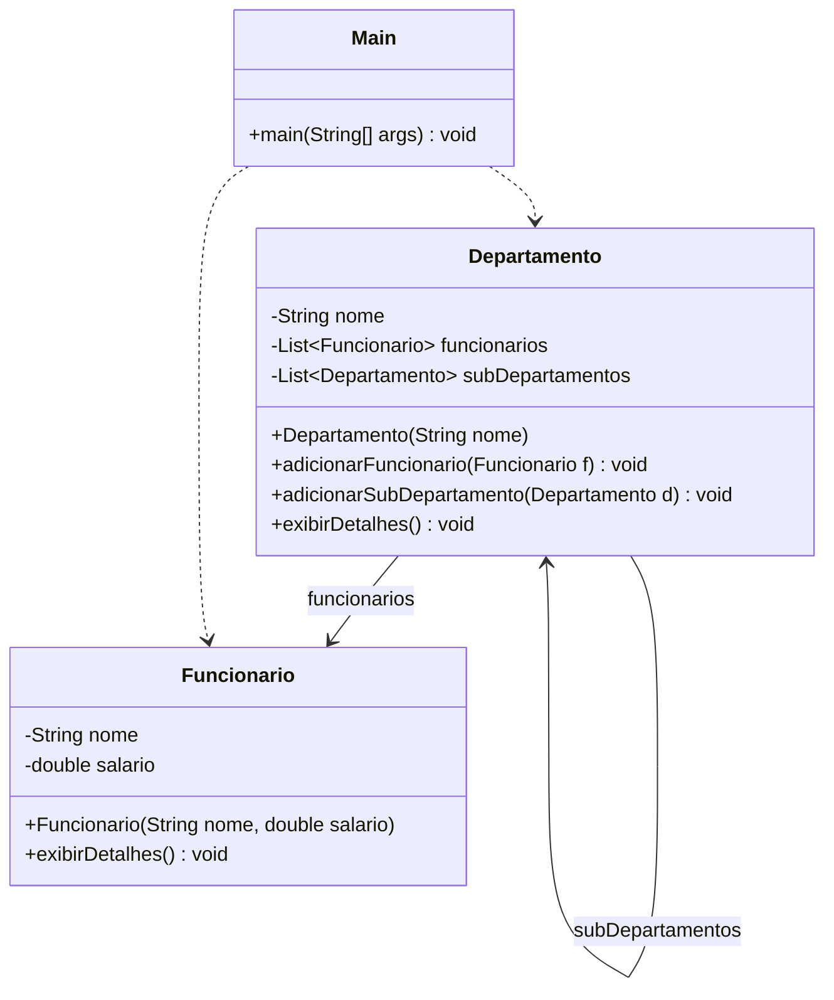

# Anti-Padrão — Composite

> **Problema:** `Departamento` mantém duas listas separadas — uma para `Funcionario` e outra para sub-`Departamento`. Não existe interface comum, então o cliente precisa conhecer e tratar cada tipo de forma diferente. Adicionar um novo tipo de nó exige modificar `Departamento`.

