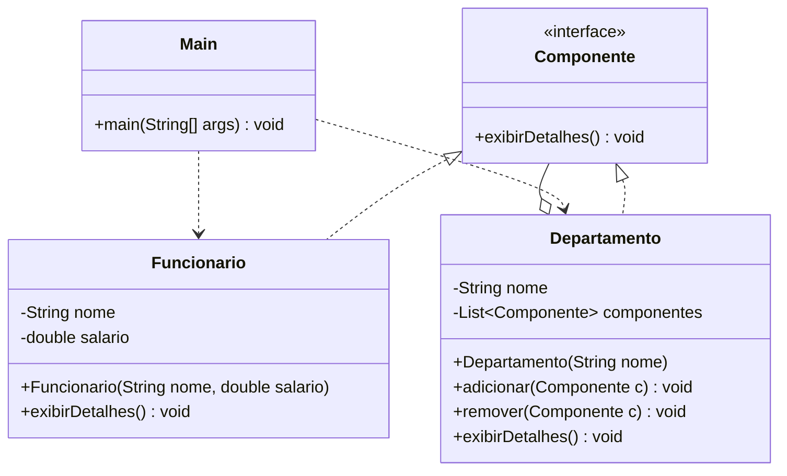

# Padrão — Composite

> **Solução:** `Componente` é a interface comum para folhas (`Funcionario`) e compostos (`Departamento`). O cliente usa somente `Componente`, sem distinção — toda a hierarquia é percorrida de forma uniforme com um único método `exibirDetalhes()`.

