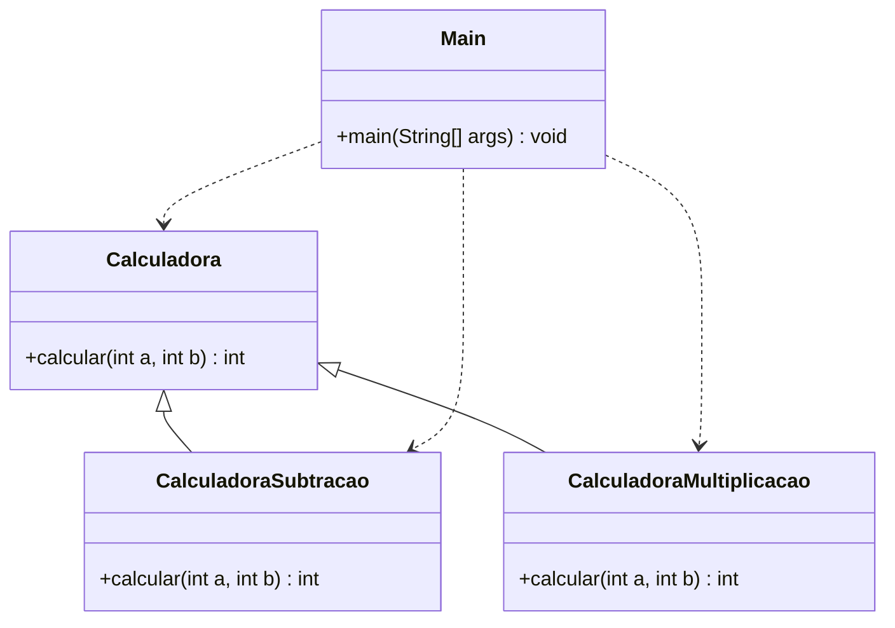

# Anti-Padrão — Estratégia

> **Problema:** as variações de comportamento são implementadas via **herança**, obrigando a criação de uma nova subclasse para cada operação e acoplando o comportamento ao tipo do objeto.

