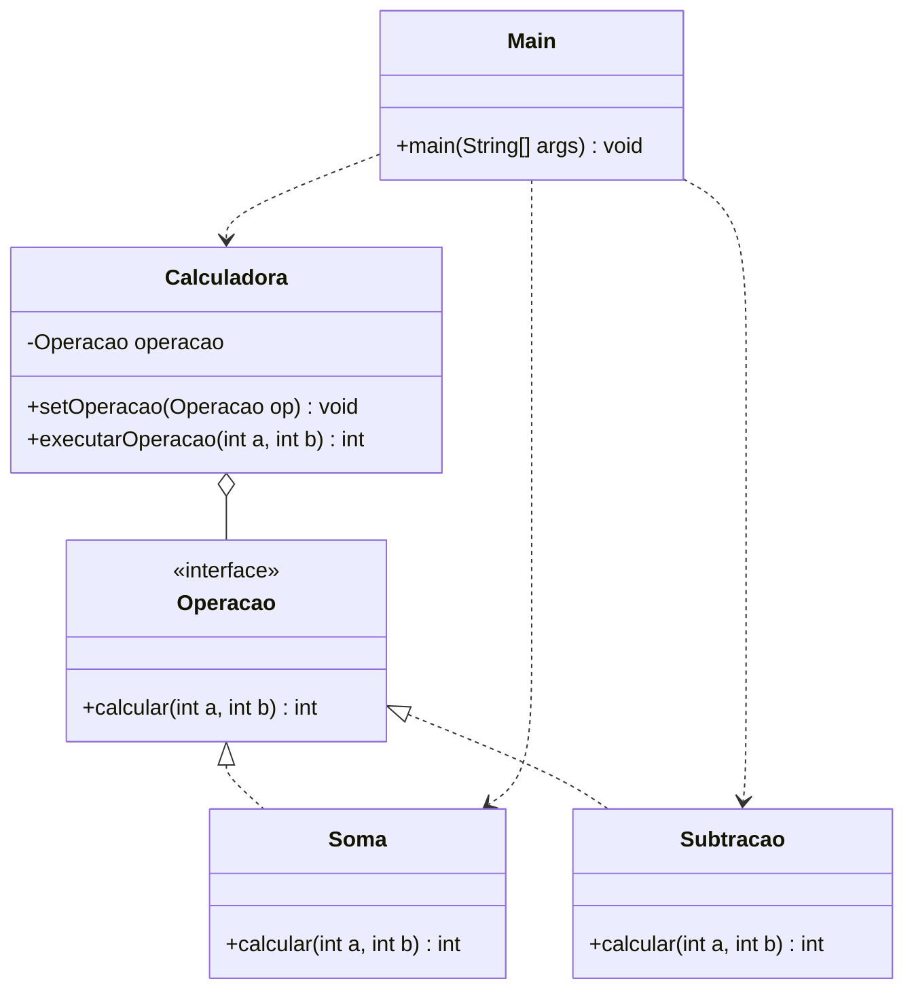

# Padrão — Estratégia

> **Solução:** o comportamento é encapsulado em uma **interface** (`Operacao`). A `Calculadora` recebe qualquer implementação via composição, sem precisar de herança.

```mermaid
classDiagram
    class Operacao {
        <<interface>>
        +calcular(int a, int b) int
    }

    class Soma {
        +calcular(int a, int b) int
    }

    class Subtracao {
        +calcular(int a, int b) int
    }

    class Calculadora {
        -Operacao operacao
        +setOperacao(Operacao op) void
        +executarOperacao(int a, int b) int
    }

    class Main {
        +main(String[] args) void
    }

    Operacao <|.. Soma
    Operacao <|.. Subtracao
    Calculadora o-- Operacao
    Main ..> Calculadora
    Main ..> Soma
    Main ..> Subtracao
```
