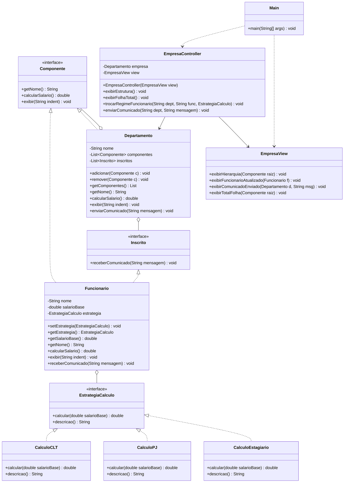

# UML — MVC com Composite + Strategy + Observer

```mermaid
classDiagram

    %% ───────────── INTERFACES ─────────────
    class Componente {
        <<interface>>
        +getNome() String
        +calcularSalario() double
        +exibir(String indent) void
    }

    class Inscrito {
        <<interface>>
        +receberComunicado(String mensagem) void
    }

    class EstrategiaCalculo {
        <<interface>>
        +calcular(double salarioBase) double
        +descricao() String
    }

    %% ───────────── STRATEGY ─────────────
    class CalculoCLT {
        +calcular(double salarioBase) double
        +descricao() String
    }

    class CalculoPJ {
        +calcular(double salarioBase) double
        +descricao() String
    }

    class CalculoEstagiario {
        +calcular(double salarioBase) double
        +descricao() String
    }

    %% ───────────── MODEL ─────────────
    class Funcionario {
        -String nome
        -double salarioBase
        -EstrategiaCalculo estrategia
        +setEstrategia(EstrategiaCalculo) void
        +getEstrategia() EstrategiaCalculo
        +getSalarioBase() double
        +getNome() String
        +calcularSalario() double
        +exibir(String indent) void
        +receberComunicado(String mensagem) void
    }

    class Departamento {
        -String nome
        -List~Componente~ componentes
        -List~Inscrito~ inscritos
        +adicionar(Componente c) void
        +remover(Componente c) void
        +getComponentes() List
        +getNome() String
        +calcularSalario() double
        +exibir(String indent) void
        +enviarComunicado(String mensagem) void
    }

    %% ───────────── VIEW ─────────────
    class EmpresaView {
        +exibirHierarquia(Componente raiz) void
        +exibirFuncionarioAtualizado(Funcionario f) void
        +exibirComunicadoEnviado(Departamento d, String msg) void
        +exibirTotalFolha(Componente raiz) void
    }

    %% ───────────── CONTROLLER ─────────────
    class EmpresaController {
        -Departamento empresa
        -EmpresaView view
        +EmpresaController(EmpresaView view)
        +exibirEstrutura() void
        +exibirFolhaTotal() void
        +trocarRegimeFuncionario(String dept, String func, EstrategiaCalculo) void
        +enviarComunicado(String dept, String mensagem) void
    }

    class Main {
        +main(String[] args) void
    }

    %% ───────────── RELAÇÕES ─────────────

    %% Composite
    Componente <|.. Funcionario
    Componente <|.. Departamento
    Departamento o-- Componente

    %% Observer
    Inscrito <|.. Funcionario
    Departamento o-- Inscrito

    %% Strategy
    EstrategiaCalculo <|.. CalculoCLT
    EstrategiaCalculo <|.. CalculoPJ
    EstrategiaCalculo <|.. CalculoEstagiario
    Funcionario o-- EstrategiaCalculo

    %% MVC
    EmpresaController --> Departamento
    EmpresaController --> EmpresaView
    Main ..> EmpresaController
    Main ..> EmpresaView
```
