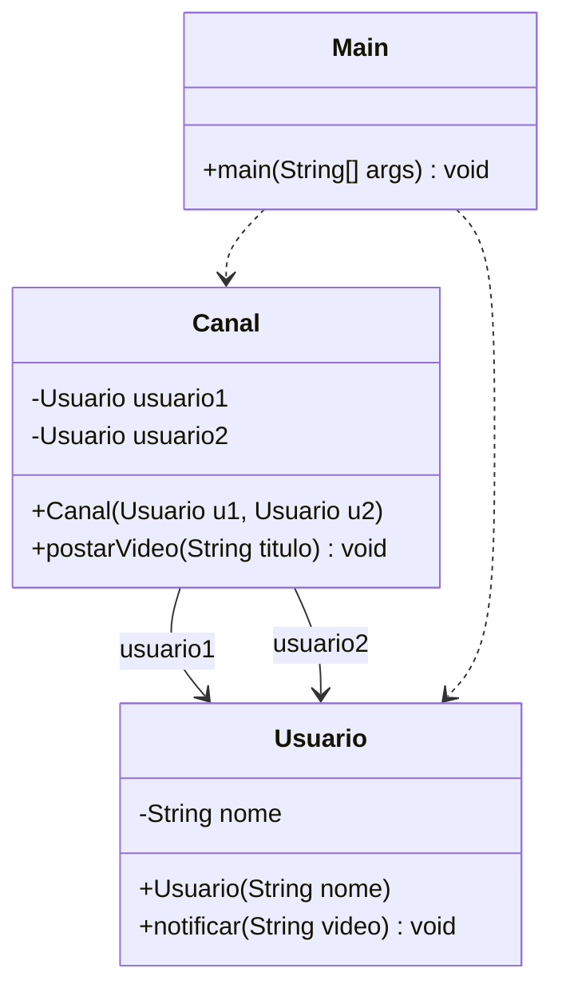

# Anti-Padrão — Observer

> **Problema:** `Canal` conhece diretamente cada `Usuario` concreto como atributo. Para adicionar um novo inscrito é necessário **modificar** o construtor e o método `postarVideo()` de `Canal`.

