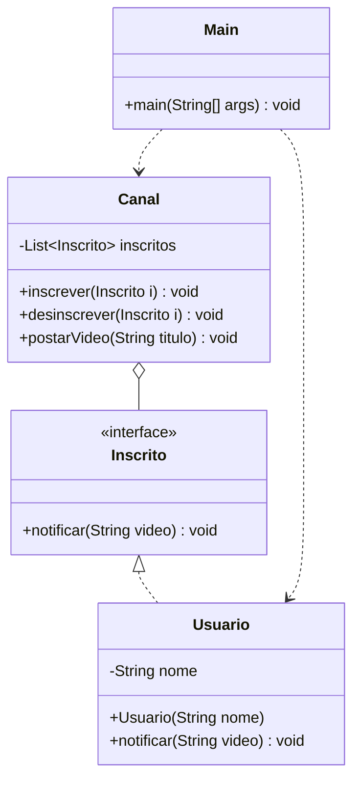

# Padrão — Observer

> **Solução:** `Canal` depende apenas da interface `Inscrito`. Novos tipos de inscritos podem ser adicionados sem nenhuma modificação em `Canal` — basta implementar a interface.

